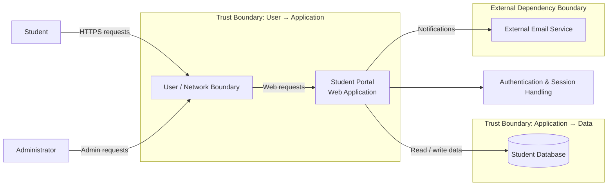

# Threat-Model Diagram

```mermaid
flowchart LR
    Student["Student"]
    Admin["Administrator"]
    Internet["User / Network Boundary"]
    Web["Student Portal<br/>Web Application"]
    Auth["Authentication & Session Handling"]
    DB[("Student Database")]
    Email["External Email Service"]

    Student -->|"HTTPS requests"| Internet
    Admin -->|"Admin requests"| Internet
    Internet -->|"Web requests"| Web
    Web --> Auth
    Web -->|"Read / write data"| DB
    Web -->|"Notifications"| Email

    subgraph TB1["Trust Boundary: User → Application"]
        Internet
        Web
    end

    subgraph TB2["Trust Boundary: Application → Data"]
        DB
    end

    subgraph TB3["External Dependency Boundary"]
        Email
    end
```

**Scope:** Fictional/local defensive threat-modeling exercise only.
