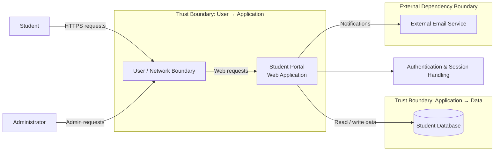

# Threat Model – Fictional Student Portal

## 1. System Context
The modeled system is a small web-based student portal. Students access it through a web browser. An administrator can access administrative functionality. The web application communicates with a database and may use an external email service.

> **Note:** The architecture below is a modeling assumption because the task brief does not provide an implementation-specific architecture.

## 2. Assets and Owners

| Asset | Owner / Responsible Party | Security Concern |
|---|---|---|
| Student credentials | Application owner | Confidentiality and account integrity |
| Student personal information | Application owner | Confidentiality |
| Course/enrollment records | Application owner | Integrity and confidentiality |
| Session tokens | Application owner | Confidentiality and session integrity |
| Administrator accounts | Application owner | Privilege and system integrity |
| Audit/security logs | Application owner | Accountability and investigation |
| Application availability | Application owner | Availability |

## 3. Users and External Dependencies
**Users:** Student, Administrator

**External dependency:** Email service for account-related or notification messages.

## 4. Trust Boundaries and Entry Points

### User → Web Application
Potential concerns: credential abuse, session abuse, malicious input, unauthorized requests.

### Web Application → Database
Potential concerns: unauthorized data access, data tampering, unsafe database access, excessive database privileges.

### Web Application → Email Service
Potential concerns: sensitive information disclosure, notification abuse, improper handling of service credentials.

### Administrator → Administrative Interface
Potential concerns: privilege escalation, administrative account compromise, unauthorized modification of records.

## 5. Threat-Model Diagram

## 6. STRIDE Threat Analysis

### T01 – Spoofing: Account Takeover
**Asset:** Student or administrator account

**Scenario:** An attacker obtains or guesses credentials and authenticates as another user.

**Precondition:** Weak credentials, credential reuse, or insufficient authentication protections.

**Impact:** Unauthorized access to student information or administrative functionality.

**Recommended controls:** Strong password policy, secure password storage, login rate limiting, temporary delays after repeated failures, secure session management, and stronger protection for privileged accounts.

**Priority:** High

### T02 – Tampering: Unauthorized Record Modification
**Asset:** Course/enrollment records

**Scenario:** A user modifies records they are not authorized to change.

**Precondition:** Missing or incorrect server-side authorization.

**Impact:** Loss of record integrity.

**Recommended controls:** Server-side authorization, object ownership checks, least privilege, and logging of sensitive record changes.

**Priority:** High

### T03 – Repudiation: Missing Administrative Audit Trail
**Asset:** Security/audit logs

**Scenario:** A sensitive administrative action cannot be reliably associated with an account or event.

**Precondition:** Insufficient security logging.

**Impact:** Difficulty investigating incidents and establishing accountability.

**Recommended controls:** Log authentication events, privilege changes, and important administrative actions; include timestamps and relevant event/account identifiers; protect logs from unauthorized modification.

**Priority:** Medium

### T04 – Information Disclosure: Student Data Exposure
**Asset:** Student personal information

**Scenario:** An unauthorized user obtains student information through an access-control failure or excessive data exposure.

**Precondition:** Missing authorization checks or overly broad responses.

**Impact:** Confidentiality and privacy impact.

**Recommended controls:** Server-side authorization, data minimization, protected transport, access-permission review, and avoiding unnecessary information in responses.

**Priority:** High

### T05 – Denial of Service: Excessive Request Abuse
**Asset:** Application availability

**Scenario:** An attacker sends excessive requests to resource-intensive or authentication endpoints.

**Precondition:** No effective rate limiting or request controls.

**Impact:** Reduced availability for legitimate users.

**Recommended controls:** Rate-limit sensitive endpoints, apply request/resource limits, monitor abnormal request patterns, and add appropriate alerting.

**Priority:** Medium

### T06 – Elevation of Privilege: Student to Administrator
**Asset:** Administrator functionality and accounts

**Scenario:** A normal student account gains access to administrative functionality.

**Precondition:** Broken or missing server-side authorization checks.

**Impact:** Unauthorized access to administrative actions and sensitive records.

**Recommended controls:** Server-side role checks, default-deny access, separated student/admin permissions, authorization on every privileged action, and privilege-sensitive logging.

**Priority:** High

## 7. Threat Prioritization

| ID | STRIDE | Threat | Likelihood | Impact | Priority |
|---|---|---|---|---|---|
| T01 | Spoofing | Account takeover | High | High | Critical |
| T02 | Tampering | Unauthorized record modification | Medium | High | High |
| T03 | Repudiation | Missing administrative audit trail | Medium | Medium | Medium |
| T04 | Information Disclosure | Student data exposure | Medium | High | High |
| T05 | Denial of Service | Excessive request abuse | Medium | Medium | Medium |
| T06 | Elevation of Privilege | Student-to-admin privilege escalation | Medium | Critical | High |

These ratings are threat-modeling judgments for the fictional system, not results from testing a live application.
